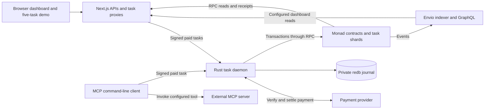

# Aetheris architecture

Aetheris gives agent tasks separate express-checkout lanes on Monad Testnet. Each task gets its own place to record a result, so unrelated results do not all update one shared storage slot. Identity answers who may use a lane, payment pays for the routing service, and receipts show what was recorded. Separate lanes reduce one source of contention; network capacity, transaction fees and the signers sending transactions still matter.

Computation happens before the daemon records its commitments. There are two implemented ways to supply it: the browser runs five small checksum tasks, and the command-line client invokes a real configured MCP tool. Both can submit signed, paid tasks and check their blockchain receipts. The guided browser preview is explicitly simulated and makes no transactions.

For setup, use the [project README](../README.md) and [runbook](runbook.md). The [shared protocol](protocol.md) specifies byte encodings and test vectors; the [frontend guide](../frontend/docs/README.md) explains the screens and their data sources. This document describes implemented connections, not evidence that external services have already been deployed.

## The system at a glance

Wallets also send delegation transactions directly to Monad. Browser and CLI clients independently read receipts through RPC. Agent cards come from the configured IPFS gateway. Validation and reputation are separate contract operations; a completed task does not implicitly complete either of them.

| Component | Its job | What it does not establish |
| --- | --- | --- |
| [Next.js frontend](../frontend/app/page.tsx) | Discovery, activity and shard views; Dynamic wallet access; optional Mera access; preview and signed live browser demo | A working screen alone does not prove payment settlement or external agent computation |
| [MCP task client](../scripts/submit_task.ts) | Invoke a configured MCP tool, preserve exact input/output bytes, submit a paid task, verify receipts and optionally publish reviewed feedback | A tool result is not automatically correct or independently validated |
| [Rust daemon](../daemon/src/main.rs) | Check task permissions and payment, journal requests, route transactions, track settlement and optionally commit Merkle batches | It does not execute MCP tools, judge outputs or verify hardware quotes itself |
| [AgentRegistry](../contracts/src/AgentRegistry.sol) | ERC-721 agent identities, card URIs, metadata and ownership | Registration does not verify capability claims |
| [AetherisRouter](../contracts/src/AetherisRouter.sol) | Agent-scoped delegates, deterministic task deployment, result routing and authorized batch commitments | It does not enforce the HTTP payment policy or a cumulative spending budget |
| [EphemeralShard](../contracts/src/EphemeralShard.sol) | One task's immutable context and one completed result | Storage separation is not confidentiality or deletion |
| [ReputationRegistry](../contracts/src/ReputationRegistry.sol) | Client feedback, responses, revocations and separate records of completed shards | A rating is an opinion from its author, not a verified correctness score |
| [ValidationRegistry](../contracts/src/ValidationRegistry.sol) | Explicit requests, validator responses, output-hash checks, trusted TEE statements and authenticated CRE reports | A stored proof hash alone is not a valid attestation |
| [Envio HyperIndex](../indexer/src/EventHandlers.ts) | Searchable chain history and per-block Merkle roots; independent comparisons with committed roots | Indexing is not payment settlement, consensus finality or proof of computation |

These are application-specific deployments on chain `10143`. Services must use consistent router, registry and deployment-block settings. The router has immutable identity and validation registry references; deployment also connects the reputation registry to the router. A manifest supplies configuration, while successful canonical deployment receipts establish that its addresses actually exist.

## Two task flows, one recording protocol

### Browser: five signed, paid checksum tasks

The live demo uses the configured agent identity for five separate task instances. Its visual lanes are not five newly registered agents. Each task hashes a small input document and records a checksum result calculated in the browser. This exercises real authorization, routing and settlement without claiming that an AI model or MCP server ran.

| Step | Current behavior |
| --- | --- |
| Discover configuration | `/api/demo/config` reads daemon `/v1/config` and checks the dashboard deployment and payment policy. Live mode requires operator configuration and a supported Dynamic wallet |
| Check permission and funds | Check Monad Testnet, agent ownership/delegation, authorized executor wallets and enough payment tokens for all five tasks |
| Approve | Sign each exact task and a separate EIP-3009 payment. Pin chain, token, receiver, amount ceiling, signing domain, expiry and resource before signing |
| Save and submit | Save public recovery metadata before submitting five tasks concurrently through `/api/demo/tasks` to `POST /v1/tasks`. Active task and payment signatures remain in memory |
| Verify | Check predicted CREATE2 address and salt, canonical creation/execution receipts, exact task event fields, and token `Transfer` plus `AuthorizationUsed` events for the saved payment nonce |
| Recover | Poll saved request IDs through `/api/demo/tasks/[requestId]`. Recovery creates no fresh payment or repeated POST; reloaded success is checked again on-chain |

The Next.js proxy restricts submissions to the configured agent and relayers, checks the origin, bounds payloads, validates payment policy and recovers both signatures to the same payer. The daemon independently checks current on-chain authority. Neither an origin header nor wallet login grants task permission. The proxy holds no relayer key and does not sign payments for visitors.

Browser verification waits for two confirmations and checks canonical block hashes. The daemon has its own configured confirmation threshold. These checks are distinct from the finalized-block requirement for Merkle batching. The browser flow does not automatically submit reputation feedback or validation requests.

Sources: [demo UI](../frontend/components/InteractiveDemo.tsx), [wallet orchestration](../frontend/components/DemoWallet.tsx), [task client and recovery](../frontend/lib/demo-client.ts), [proxy checks](../frontend/lib/demo-server.ts), [payment and receipt checks](../frontend/lib/demo-protocol.ts).

### Command line: an actual MCP invocation

The [task CLI](../scripts/README.md) uses the MCP SDK's Streamable HTTP transport to initialize a configured server connection, find a requested tool and invoke it. It rejects unsuccessful or malformed results. Canonical UTF-8 input/output bytes are preserved locally before their commitments are calculated; those bytes are not uploaded to the shard.

The client obtains an HTTP 402 challenge, checks it against operator limits, signs the task and an x402 v2 EIP-3009 payment, and submits to `POST /v1/tasks`. It supports this payment path, not a Graph Tally client. `--prepare-only` permits output inspection before payment. `--resume` uses the private journal and does not repeat an ambiguous MCP invocation or task POST.

After independently verifying task and payment receipts, it calls the public `recordTaskExecution(shard)` function. Optional feedback requires a separately configured, eligible reviewer and an explicit assessment of the actual output. No rating is generated automatically. Reputation transactions are durably saved before broadcast and reconciled on resume, including a race where another caller records the completed shard first.

Public proof contains an allowlist of task and receipt evidence. Private journals, MCP contents, keys and payment credentials are not publication artifacts. A task signature can be exported only after its authorization expires. This proves which bytes were committed and paid for; judging output quality remains a separate responsibility.

Sources: [MCP transport](../scripts/lib/mcp.ts), [payment limits](../scripts/lib/payment.ts), [receipt verification](../scripts/lib/settlement.ts), [reputation operations](../scripts/lib/reputation.ts), [durable transactions](../scripts/lib/transactions.ts), [proof export](../scripts/lib/proof.ts).

## Who can do what

| Role | Authority | Boundary |
| --- | --- | --- |
| Agent owner | Own the ERC-721 identity, manage its card and authorize/revoke router delegates | Ownership is not an attestation of capabilities |
| Task signer | Sign the exact agent, task, sequence, executor, input/output/proof hashes and deadline | Must be the current owner or an active router delegate; HTTP transport accepts Ethereum ECDSA EOA signatures |
| Daemon executor | Create and complete tasks with its assigned relayer account | Must be configured in the daemon and authorized by the router; only the assigned executor can complete its shard |
| Router administrator | Select batch committers | Administrative ownership does not replace per-agent task permission |
| Batch committer | Submit immutable batch records | The router checks authority and structure, not a recomputation of historical logs |
| Feedback author | Publish an eligible client's assessment and revoke their own feedback | Public feedback remains susceptible to low-quality or coordinated submissions |
| Assigned validator / trusted attestor | Respond to an explicit validation request under its applicable checks | Separate from the executor, HTTP payment and ordinary task completion |
| Payment provider | Verify and settle the configured payment mechanism | Provider acknowledgment and confirmed token transfer are different evidence |

Router delegation names an agent, delegate and expiry. Grants bind to the owner's ownership epoch, so transferring an identity away and back cannot revive an old grant. ERC-721 approvals and router delegation are distinct permissions. The daemon checks both the task signer and selected executor; payment cannot substitute for either check.

**Permission and budget are separate.** There is no cumulative per-agent spending-budget contract, daily cap or automatic gas sponsor. Client payment ceilings constrain what those clients sign. A router delegate can make authorized direct calls outside the HTTP payment gate. Transactions consume gas, and a signer still has an ordered account nonce. Operators must fund and isolate the relayer accounts they use.

Task authorization uses EIP-712 domain `AetherisTask`, version `1`, chain `10143` and the router as verifier. The signing digest is the HTTP request ID, and deadlines must fit the daemon's allowed window. See the [daemon API](../daemon/README.md) and [shared protocol](protocol.md) for exact fields and encodings.

## What a shard isolates

A shard is a separate Solidity contract deployed with CREATE2. Its salt combines the agent ID, task ID and sequence nonce. The complete address also depends on the router, constructor bytecode and constructor arguments; clients call `predictShardAddress` against the deployed router instead of assuming the salt alone determines the address.

The router rejects reused salts even when the proposed executor or input changes. Each shard fixes its agent, task, sequence, executor and input at creation. Only its creating router can write its output, and completion succeeds once. The router checks that the assigned executor remains authorized at completion.

The narrow benefit is that completing unrelated shards writes separate result storage. Completion does not increment a shared router task counter or automatically update reputation. Creation still updates deployment bookkeeping; account nonces, gas payment, shared reads and other network work remain. Separate relayer accounts allow independent submissions, while each daemon signer's transactions are serialized.

“Ephemeral” describes the task's lifetime. Contracts and their public commitments remain on-chain permanently. Hashes do not encrypt data, and predictable values can be guessed. This repository does not implement confidential execution or threshold encryption. Its write-set tests exercise storage isolation; they do not establish zero collisions, unlimited throughput, a speedup or a measured Monad scheduler result.

Sources: [router and CREATE2](../contracts/src/AetherisRouter.sol), [write-once task storage](../contracts/src/EphemeralShard.sol), [router tests](../contracts/test/AetherisRouter.t.sol).

## Daemon, payment and durable state

The Axum daemon uses Tokio for concurrent work, Alloy for Monad interaction and a transactional redb database for durable state. That private journal is not a disposable cache: it contains jobs, canonical task identities, payment replay reservations, signed request context, transaction intent and the batch cursor.

| Boundary | Implemented behavior |
| --- | --- |
| Acceptance | Check task authority and payment before atomically reserving the job, canonical identity and payment replay ID |
| Deduplication | Canonical identity is chain, router, agent, task ID and sequence. A renewed deadline returns the original matching job; changed execution intent conflicts instead of purchasing another execution |
| Dispatch | Persist nonce and broadcast intent before sending; save the returned transaction hash before awaiting confirmations. Create the shard, then complete it |
| Payment | After confirmed execution, retain the result and settle through the provider. Report completion only with a successful settlement response |
| Uncertain broadcast | An intent without a known transaction hash stops that signer from silently reusing its nonce. A known, confirmed reverted transaction can release it for unrelated work |
| Restart | Mark interrupted accepted or settlement-pending jobs `reconciliation_required`, retaining evidence instead of automatically charging again |

An HTTP disconnect does not cancel an already spawned daemon worker. A process crash is different: execution and payment are not one atomic cross-system transaction. A task may be on-chain while settlement remains uncertain. Durable statuses expose that distinction; exactly-once settlement across independent systems is not promised. Each relayer key must be exclusive to its daemon, and the database takes an exclusive filesystem lock.

Normal payment uses x402 v2 `exact` signaling with an EIP-3009 token. An unpaid request receives `PAYMENT-REQUIRED`; a credential arrives in `PAYMENT-SIGNATURE`. The facilitator must actually support the chain and token. The daemon binds payer to task signer, reserves a payment-nonce replay key, calls verification/settlement and checks semantic success, payer, network and transaction hash. Browser and CLI clients add exact token-receipt checks.

Alternative Graph Tally mode verifies the real v2 receipt structure and configured signature domain but uses a **custom Aetheris HTTP adapter** for escrow authorization and aggregation. That adapter is external; this is not an official Graph Tally HTTP API or a claim of an existing Monad deployment. Accepted aggregation is not automatically final on-chain redemption. See the [daemon payment section](../daemon/README.md#payments-and-graph-tally-trust-boundary) for the adapter contract and trust requirements.

Sources: [request lifecycle](../daemon/src/main.rs), [transaction coordination](../daemon/src/router.rs), [redb journal](../daemon/src/store.rs), [payment verification](../daemon/src/x402.rs).

## Merkle batches and independent indexing

A Merkle root is a compact receipt for a collection of task events. It could summarize 100 events, for example, but 100 is not a fixed batch size and the root does not prove those computations correct.

The optional daemon worker commits **one batch per nonempty finalized block**, not one per day. It includes all `TaskExecuted` events from the configured router in that block, including executions submitted outside the daemon. Empty blocks advance the cursor without an empty commitment. The RPC must support `finalized`; changed canonical hashes or broken continuity stop the worker for reconciliation.

Leaves bind chain, router, shard, agent, task and input/output/proof hashes. Events follow chain order. Leaf double hashing, sorted pair hashing, odd-node duplication and the block-hash-bound batch ID must agree across Rust and TypeScript. The [shared protocol](protocol.md) gives exact definitions and fixed interoperability vectors.

Envio separately derives `Agent`, `EphemeralShard`, `TaskExecution`, `MerkleBatch`, `BatchCommitment` and synchronization records. Tree state lives in its indexed database so normal chain rollback can rebuild it. When a commitment arrives, Envio compares its batch identity, root, leaf count and single-block range with its own calculation.

| Indexed status | Meaning |
| --- | --- |
| `observed` | Execution events for a block are being collected |
| `complete` | The indexer has advanced past that block; this alone is not consensus finality |
| `committed` | An on-chain commitment matches the indexer's calculation |
| `mismatch` | An observed commitment differs and requires investigation |

The router trusts its approved committer to supply a correct historical root. The indexer's comparison is independent consistency evidence, not an on-chain fraud-proof or slashing mechanism. Merkle commitment also does not pay the individual tasks: x402 settlement is separate.

Sources: [batch worker](../daemon/src/merkle.rs), [event handlers](../indexer/src/EventHandlers.ts), [TypeScript Merkle code](../indexer/src/merkle.ts), [entity schema](../indexer/schema.graphql).

## Identity, reputation, validation and passkeys are different layers

An agent card is a digital passport and resume: it connects an on-chain identity to descriptions and service endpoints. Registration does not check whether an advertised MCP service is available or its claims are true. The directory treats card contents as untrusted display data; the CLI calls the endpoint explicitly configured by its operator.

Reputation holds fixed-point client feedback, responses and revocations. Contract summaries use an explicit client set; the dashboard's quality view is submitted feedback, not a universal or Sybil-resistant trust score. Separate task recording establishes that a router-created shard completed once. It does not award a positive review. CLI completion recording and optional reviewed feedback are different transactions.

| Mechanism | What is checked | What must still exist outside ordinary task routing |
| --- | --- | --- |
| Output-hash validation | Supplied bytes match the expected commitment in an explicit validation request | A reason to believe those bytes answer the task correctly |
| TEE adapter | An approved attestor's signature binds request, output, approved measurement, evidence hash and expiry; replay is rejected | A trusted verifier that actually checks hardware evidence and issues the statement |
| Chainlink CRE receiver | Configured forwarder, allowed workflow identity/name/owner, matching request/output, chain/receiver, time bounds and replay checks | A real CRE workflow, target-chain forwarder and deployed configuration; the receiver is not a bundled workflow deployment |
| Dynamic passkey access | A configured provider mediates device sign-in and wallet signing | Dynamic environment, supported wallet and agent ownership/delegation |
| Mera passkey access | Authenticator PRF derives a standard secp256k1 EVM account; the UI signs explicit router delegation | HTTPS or localhost, PRF support, the same passkey/relying party, an owned identity and gas funds |

The router's validation-registry reference does not make validation mandatory for `executeTask`. The daemon accepts an authorized proof hash as a commitment; payment and completion do not turn it into a verified TEE or CRE result. Validation must be requested and delivered separately.

CRE requires the approved workflow owner to match the request's validator. The receiver authenticates its configured forwarder; it does not independently verify DON signatures or accept arbitrary caller reports. Deployment must establish that the chosen forwarder is the official target-chain service.

Mera and Dynamic are separate wallet integrations. Mera supplies neither threshold encryption nor gas sponsorship nor an account recovery service. Derived key material stays out of persistent storage, and each delegation asks for a fresh passkey ceremony; browser memory and authenticator security remain trust boundaries. Passkeys can hide seed handling from users, while delegation still costs gas unless an external sponsor pays. The HTTP task transport expects ECDSA EOA authorization, not a raw P256 WebAuthn assertion or EIP-1271 smart-wallet signature.

Sources: [identity](../contracts/src/AgentRegistry.sol), [reputation](../contracts/src/ReputationRegistry.sol), [validation and CRE](../contracts/src/ValidationRegistry.sol), [Dynamic delegation](../frontend/components/WalletAccess.tsx), [Mera UI](../frontend/components/MeraAccess.tsx), [Mera account derivation](../frontend/lib/mera-account.ts).

## Dashboard data and operating conditions

With `ENVIO_GRAPHQL_URL` configured, Next.js read APIs use deployment-scoped Envio data and expose index progress and lag. An unavailable configured indexer produces a visible error. RPC fallback is used when Envio is not configured; it reads a bounded recent event window instead of claiming complete history. Network throughput samples and contract reputation reads still use RPC.

Active agents are identities with completed executions in the displayed window. Throughput is a recent network sample, not a daemon benchmark or performance guarantee. Public RPC data cannot measure speculative collisions avoided inside Monad's execution engine. Preview animation, simulated metric examples and live receipt counts must retain distinct labels.

| Operation | Conditions and evidence |
| --- | --- |
| Read-only discovery/activity | Working RPC and consistent contract addresses; optional IPFS and Envio. The daemon may be offline |
| Guided preview | Browser only; explicitly simulated, without wallet, payment or chain transaction |
| Live five-task browser demo | Dynamic setup, enabled Next.js proxy, daemon, owned/delegated agent, authorized funded relayers, compatible token/facilitator and payer balance. Success is checked against task and payment receipts |
| MCP task submission | Routing/payment prerequisites plus a reachable MCP tool and dedicated signing client; preserve exact input/output files and verified receipts |
| Merkle commitment | Enabled worker, finalized-capable RPC, deployment cursor and approved funded committer; Envio can independently compare the result |
| Reputation feedback | Eligible independent reviewer, explicit assessment and gas; omitted when unconfigured |
| TEE or CRE validation | Explicit request and separately configured trusted validation provider; ordinary execution does not automatically validate it |

`GET /health` checks RPC reachability and whether the optional batch worker is running, disabled or stopped. It is not a full payment, wallet, MCP or validation readiness check. Interrupted jobs, unknown broadcast intent and uncertain settlement require reconciliation using the retained journal and external receipts. The [runbook](runbook.md) covers operation; the [verification record](../VERIFICATION.md) distinguishes completed checks from live evidence.

Sources: [dashboard reads](../frontend/lib/server.ts), [GraphQL client](../frontend/lib/indexer.ts), [indexed-data checks](../frontend/lib/indexer-protocol.ts), [browser query hooks](../frontend/lib/queries.ts).

Aetheris connects identity, authorized paid task recording and independently inspectable receipts. Start with the [README](../README.md), use the [protocol](protocol.md) for implementation compatibility, and use the [frontend guide](../frontend/docs/README.md) to interpret live and preview views.
