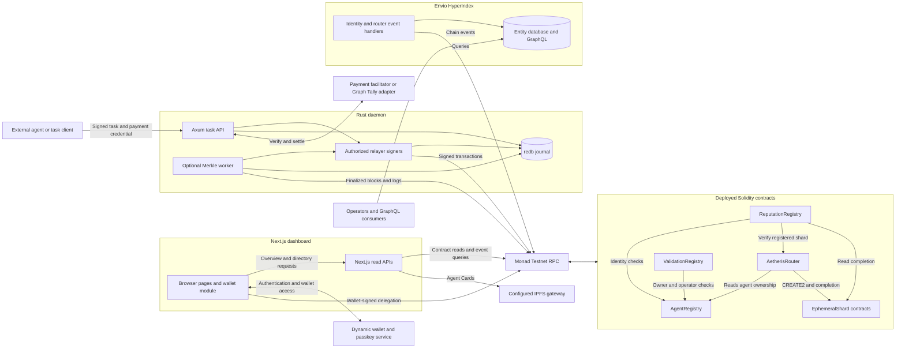

# Aetheris architecture

Aetheris coordinates authorized agent task commitments on Monad Testnet, chain `10143`. It combines ERC-8004 identities, a separate CREATE2 contract for each task attempt, a Rust transaction service, and an event indexer. The result is an auditable connection between an agent identity, its input and output commitments, and later batch commitments.

An external agent runs the computation and supplies its hashes. Aetheris currently routes those commitments and records their lifecycle. It does not invoke arbitrary MCP tools or generate task outputs itself.

This document describes the implemented repository. Use the [project README](../README.md) for entry points, the [runbook](runbook.md) for setup and operation, the [submission checklist](submission-readiness.md) for remaining demo work, and the [verification record](../VERIFICATION.md) for checks actually completed.

## System layout and actual connections



The dashboard currently reads contracts and logs through its own Next.js API routes. **It does not call the daemon task API or query Envio GraphQL.** The browser polls `/api/overview` every 12 seconds and queries `/api/agents` for directory pages. Wallet delegation is a direct contract transaction. The daemon and indexer are independently useful services, connected through the deployed contracts and their events.

Consequently, the dashboard can show chain activity while the daemon is offline. An Envio outage does not stop the current dashboard, and successful dashboard rendering does not establish that paid task routing or GraphQL indexing works. Wiring task submission and indexed history into the dashboard remains an explicit integration step.

Sources: [frontend data reads](../frontend/lib/server.ts), [browser query hooks](../frontend/lib/queries.ts), [wallet delegation](../frontend/components/WalletAccess.tsx), [daemon API](../daemon/src/main.rs), [indexer handlers](../indexer/src/EventHandlers.ts).

## Component responsibilities

| Component | Responsibility and stored state |
| --- | --- |
| [AgentRegistry](../contracts/src/AgentRegistry.sol) | ERC-721 identities with IDs starting at 1, registration URIs, named metadata, verified `agentWallet` metadata, and ownership epochs. Transfers clear the payment wallet and invalidate old router delegations through the epoch. |
| [AetherisRouter](../contracts/src/AetherisRouter.sol) | Scoped task delegates, deterministic shard deployment, used-salt tracking, task completion routing, authorized batch committers, and immutable batch records. |
| [EphemeralShard](../contracts/src/EphemeralShard.sol) | Immutable agent, task, sequence, executor and input context; one nonzero output hash, optional proof hash, and a completion flag. Only its creating router can write the result. |
| [ReputationRegistry](../contracts/src/ReputationRegistry.sol) | Fixed-point client feedback, revocations, responses and filtered summaries. A separate `recordTaskExecution` call can record an actual completed shard once. |
| [ValidationRegistry](../contracts/src/ValidationRegistry.sol) | Independent validation requests and validator responses, output-byte integrity checks, and an adapter for signed statements from approved attestation verifiers. |
| [Rust daemon](../daemon/README.md) | HTTP authorization and payment handling, durable job records, per-signer transaction serialization, and optional finalized-log batching. |
| [Envio indexer](../indexer/README.md) | Rebuilds agent and shard history, stores each execution leaf, derives per-block roots, and compares observed commitments against its own calculations. |
| [Next.js frontend](../frontend/README.md) | Agent discovery, recent RPC-derived activity, shard inspection, Dynamic authentication, and owner-signed executor delegation. |

The deployment script creates application-specific registries and a router. Their addresses must be configured consistently across services; they are not assumed to be pre-existing canonical registries on the network. The frontend checks that configured router and reputation contracts reference the expected identity registry.

## Identity, discovery and access

An agent owner registers an identity and associates it with a URI. The example [Agent Card](../contracts/agent-card.example.json) describes the ERC-8004 registration format and an MCP service endpoint. Contract registration proves control of the identity token and its metadata pointer; it does not prove that a service is reachable or that the agent has the advertised capabilities.

The directory fetches `ipfs://` cards through an operator-configured HTTPS gateway. It rejects redirects and traversal paths, caps card bodies at 256 KiB, and applies a six-second timeout. It displays service URLs as text rather than invoking them. Although the identity contract accepts other URI schemes, the dashboard's current metadata reader supports IPFS cards only.

There are separate permissions for separate operations:

| Permission | Who grants or proves it | What it permits |
| --- | --- | --- |
| Identity ownership / ERC-721 approval | The identity owner | Identity transfers and supported metadata management. ERC-721 approval alone does not authorize router tasks. |
| Router delegation | Current identity owner calls `setDelegate` | A named address may create or execute tasks for that agent until expiry. An expiry of zero revokes it. |
| HTTP task authorization | Authorized EOA signs `TaskAuthorization` | The daemon may route the exact signed task context using the chosen configured executor. |
| Payment credential | Task signer supplies a valid credential | The daemon may verify and later settle payment under its configured scheme. |
| Batch committer | Router administrator calls `setCommitter` | Publish Merkle batch records. This role is separate from agent delegation. |
| TEE attestor and measurement | Validation administrator configures allowlists | The registry may accept an assigned validator's signed attestation for an approved measurement. |

A router delegation stores the granting owner and ownership epoch. Transferring an identity away and back cannot reactivate the old grant. The creator and assigned executor must be authorized at shard creation; completion requires both the assigned executor and current authorization.

Dynamic provides passkey authentication and access to an EVM wallet. The application does not export a P-256 private key or validate raw WebAuthn assertions on-chain. A Dynamic login also does not establish agent ownership: the wallet module checks the registry, simulates the delegation call, obtains the wallet's signature, and waits for its receipt.

The daemon transport currently accepts an Ethereum ECDSA task signature. An owner using an ERC-1271 smart contract wallet can grant a scoped EOA delegate for this transport. ERC-1271 support in registry wallet proofs and validation attestations is distinct from the HTTP task signature format.

## Task lifecycle

The external caller supplies `agentId`, `taskId`, `sequenceNonce`, input/output/proof hashes, a configured executor, a short-lived deadline, and an EIP-712 signature. Large integer values travel as decimal strings in JSON. The signature includes the chain and deployed router through its EIP-712 domain; the exact layout is in the [daemon API documentation](../daemon/README.md#api-and-signed-requests).

```mermaid
sequenceDiagram
    participant Client as External task client
    participant Daemon as Axum API / worker
    participant Pay as Payment service
    participant DB as redb journal
    participant Router as AetherisRouter
    participant Shard as Task shard

    Note over Client: Compute output externally and sign the task commitments
    Client->>Daemon: POST /v1/tasks with task signature and payment header
    Daemon->>Router: Check authorization of client and selected relayer
    Daemon->>DB: Look up request and canonical task identity
    alt Existing matching task
        DB-->>Daemon: Original job
        Daemon-->>Client: Original status and result; no second settlement
    else New task
        Daemon->>Pay: Verify payment credential
        Pay-->>Daemon: Verification result and payer
        Daemon->>DB: Atomically reserve task, job, payment ID and signed material
        Note over Daemon: Acquire chosen signer's lock and recheck authorization
        Daemon->>Router: Read predictShardAddress
        Daemon->>DB: Persist creation broadcast intent
        Daemon->>Router: Submit createShard transaction
        Router->>Shard: Deploy with CREATE2
        Router-->>Daemon: Creation receipt; wait configured confirmations
        Daemon->>DB: Persist completion broadcast intent
        Daemon->>Router: Submit executeTask transaction
        Router->>Shard: Store outputHash and proofHash once
        Router-->>Daemon: Execution receipt; wait configured confirmations
        Daemon->>DB: Save result as settlement_pending
        Daemon->>Pay: Settle verified payment
        alt Settlement acknowledged
            Daemon->>DB: Save completed status and payment receipt
            Daemon-->>Client: 200 result with PAYMENT-RESPONSE
        else Settlement failed or uncertain
            Daemon->>DB: Retain result and settlement_pending status
            Daemon-->>Client: Failure response requiring reconciliation
        end
    end
```

Missing or invalid payment credentials produce HTTP 402 with payment requirements. The new task is durably accepted only after successful task/payment checks and an atomic database reservation. A transaction failure or ambiguous submission produces `reconciliation_required`; no fabricated completion is returned.

The request handler awaits a spawned worker. Disconnecting the HTTP client does not cancel that worker while the daemon process remains alive. A concurrent retry can return an existing `accepted` job with HTTP 202; clients can also query `GET /v1/tasks/{requestId}`. This is not a durable background queue that automatically resumes all interrupted work after a process restart.

The router does not receive or verify the daemon's HTTP task signature or payment credential. It enforces the on-chain executor delegation. A delegated executor can therefore call the router directly, and such calls do not pass through the daemon payment gate. Grant that role only to an executor trusted to commit task results within its scope.

Sources: [API orchestration](../daemon/src/main.rs), [signature checks and transaction dispatch](../daemon/src/router.rs), [payment handling](../daemon/src/x402.rs).

## CREATE2 state isolation

The task attempt key is `(agentId, taskId, sequenceNonce)`. The router computes:

```text
salt = keccak256(agentId:32 || taskId:32 || sequenceNonce:32)
shard = last20(keccak256(0xff || router:20 || salt || keccak256(initCode)))
```

Each integer is a 32-byte unsigned big-endian value. `initCode` includes the compiled shard creation code and all constructor arguments. The daemon asks the deployed router for `predictShardAddress`, avoiding an assumption that locally compiled bytecode is identical to the deployment.

The router consumes each salt once, including when a caller tries to reuse it with different constructor parameters. A deliberate new attempt needs a new sequence nonce. Each shard then accepts one result. Separate tasks write to separate contract storage; `executeTask` does not update a shared router counter or reputation summary.

This removes shared application storage writes from that completion path. CREATE2 deployments, transaction sender nonces, fee and balance handling, and other accesses can still contend. The [Foundry tests](../contracts/test/AetherisRouter.t.sol) inspect storage write sets and authorization behavior using serial EVM tests. They do not establish Monad scheduler concurrency, measured collision savings, or guaranteed single-pass execution.

Shards persist after completion. "Ephemeral" refers to their task scope, not deletion of their audit trail. The current deployment model allocates one contract per task attempt; this has deployment gas and long-term state costs.

## Merkle batches and indexed history

Two independent implementations derive the same per-block commitment: the daemon's [Merkle worker](../daemon/src/merkle.rs) and the indexer's [Merkle functions](../indexer/src/merkle.ts). Both use router `TaskExecuted` logs, including executions submitted by other clients directly to the router.

The canonical leaf is:

```text
inner = keccak256(chainId:32 || router:20 || shard:20 || agentId:32 ||
                  taskId:32 || inputHash:32 || outputHash:32 || proofHash:32)
leaf = keccak256(inner:32)
parent = keccak256(min(left,right):32 || max(left,right):32)
```

Leaves follow canonical log order. Pairs are sorted lexicographically; an odd final node is duplicated at each level. A singleton root is its leaf. Empty blocks have no root to submit. The batch ID commits to chain, router, block number and block hash. Exact encodings and shared vectors are in [protocol.md](protocol.md).

The daemon scans from `DEPLOYMENT_BLOCK` through the RPC's `finalized` block tag. It retrieves logs by block hash, checks block identity and parent continuity, and commits one complete block at a time. The first configured relayer sends the batch transaction and needs the router's separate committer role. A stopped worker is exposed through `/health`; unsupported finalized-block reads or a changed finalized hash stop processing for reconciliation.

The indexer consumes identity and router events from the earliest required deployment block. Its [schema](../indexer/schema.graphql) stores `Agent`, `EphemeralShard`, `TaskExecution`, `MerkleBatch` and `BatchCommitment` entities. Each batch carries a persisted binary frontier, so appending a leaf requires logarithmic work and participates in Envio's entity rollback behavior. Handler execution may be repeated during preload; handlers make no payment or transaction side effects.

The next block marks the prior batch `complete`. This means the indexer has finished collecting that block's events; it does not mean consensus finality. On a commitment event, the indexer compares the batch ID, single-block range, root and leaf count. It records mismatches without replacing its independently computed root.

The router trusts an authorized committer's assertion about historical logs. It does not reconstruct those logs or validate inclusion against consensus inside `commitMerkleBatch`. The indexer's comparison provides a separately computed consistency check; it is not a slashing mechanism or an on-chain dispute system.

Batch submission currently records roots on the router. It does not automatically update reputation totals, submit validation responses, or redeem Graph Tally receipts. Those operations have separate interfaces and trust requirements.

## Persistence, retries and finality

The daemon uses transactional [redb storage](../daemon/src/store.rs), accessed through blocking worker tasks so database operations do not block Tokio's async workers. The journal preserves jobs, canonical task identities, payment replay IDs, original signed requests and payment contexts, broadcast intents, transaction hashes, and the Merkle cursor.

`requestId` is the EIP-712 signing hash, so changing the signed deadline changes that ID. The canonical task key includes chain, router, agent, task and sequence and remains stable across deadline renewal. The stored intent additionally binds input, output, proof and executor. Renewing authorization returns the original job without another bill; changing the intent under the same canonical key is a conflict.

Each signer has its own lock, and different configured signers can dispatch concurrently. The daemon obtains a pending account nonce and persists broadcast intent before contacting the node. A known transaction hash is journaled before receipt polling. If an intent has no known hash after a crash or transport error, further sends by that signer are blocked until the operator reconciles its nonce. A transaction with a confirmed revert still consumes the nonce and releases the signer for unrelated work.

The durable job states are:

| State | Meaning |
| --- | --- |
| `accepted` | Request and payment replay protection are reserved; execution or confirmation is in progress. |
| `settlement_pending` | Confirmed task results are retained while payment settlement is pending, failed or uncertain. |
| `completed` | Task transactions succeeded and the configured payment service acknowledged settlement or receipt acceptance. |
| `reconciliation_required` | The process cannot safely determine or continue a prior operation; inspect the preserved journal and external state. |

Startup changes interrupted `accepted` and `settlement_pending` jobs to `reconciliation_required`, preserving known results. Retrying does not silently re-broadcast or re-charge. Restoring availability after an ambiguous boundary requires operator reconciliation; there is no exactly-once transaction spanning redb, Monad and a payment service.

Transaction confirmation depth, the Merkle worker's finalized-block policy, and the dashboard's latest-block observations are three different consistency levels. The dashboard can display recent events that later reorganize. Keep each relayer key exclusive to one daemon process and retain its journal across restarts.

## Payments and validation boundaries

The x402 mode implements HTTP v2 signaling and exact EIP-3009 payment verification through a configured facilitator. Startup checks the facilitator's advertised scheme and network. The service binds the payer to the task signer, enforces matching requirements and durable replay protection, and checks the settlement response. Verification precedes task routing; settlement follows confirmed execution, so a failed settlement can leave a completed chain task requiring payment reconciliation.

Graph Tally mode checks the configured v2 receipt layout, EIP-712 signature, collection, payer, service, receiver, value and timestamp window. A deployment must supply the documented custom adapter to check real escrow and signer authorization and durably accept or aggregate receipts. The adapter's acknowledgment does not itself prove final on-chain redemption. No Graph Tally escrow deployment or permissive adapter is included. See the [payment integration contract](../daemon/README.md#payments-and-graph-tally-trust-boundary).

Validation is separate from committing a task result. Generic validation requests identify an independent validator and request payload hash. For the TEE adapter, an approved service validates vendor quotes and certificate chains externally, then signs a request-bound statement. `ValidationRegistry` checks its signer, measurement allowlist, expiry, expected output, domain and replay state. A `proofHash` in `TaskExecuted` alone establishes none of those checks. `verifyOutputHash` establishes byte integrity against a commitment, not the correctness of the computation.

Reputation likewise records public signals rather than certifying an agent. The contract rejects owner/operator self-feedback and supports client/tag filtering. The current dashboard averages the public `quality` tag and labels the result uncurated. Reviewer selection and Sybil resistance remain application policy.

## Interfaces and remaining integration work

The shared Solidity ABI surface is exported in [contracts/abi](../contracts/abi). Rust uses Alloy bindings in [router.rs](../daemon/src/router.rs); the frontend uses Viem declarations in [contracts.ts](../frontend/lib/contracts.ts); Envio event signatures are configured in [config.yaml](../indexer/config.yaml). The [interface checker](../scripts/check-interfaces.mjs) compares those declarations with compiled Solidity artifacts. Shared encoding rules belong in [protocol.md](protocol.md) when interfaces change.

| Implemented in this repository | Required deployment or further integration |
| --- | --- |
| Registry contracts, scoped delegation and isolated task commitments | Matching deployed addresses, funded relayer accounts, registered Agent Cards and explicit permissions. |
| Daemon HTTP task routing and persistent replay protection | A caller that performs computation, signs requests and supplies payment credentials. A dashboard task-submission workflow is not currently wired. |
| Dynamic wallet UI, passkey actions and delegation transactions | A configured Dynamic environment, allowed origins, wallet recovery settings and live authentication/signing validation. |
| x402 verification/settlement client | A facilitator and payment asset that support the configured scheme on Monad Testnet. |
| Graph Tally receipt verification and adapter client | A real escrow/aggregation deployment and the documented adapter implementation. |
| Generic validation and signed TEE statements | An independent validator or trusted hardware-attestation verifier with approved measurements. |
| Envio handlers, schema, roots and commitment comparison | Native Envio code generation and generated-type checking on Linux/macOS or working WSL2, configured storage, and live indexing validation. The current verification record describes the environment block. |
| RPC-backed dashboard and GraphQL indexer as separate paths | Connect the UI to indexed history if historical GraphQL views are part of the intended demo. |
| Contract and service tests with shared vectors | A funded end-to-end task, paid settlement, batch commitment, deployment review and security review before handling real funds. |

Threshold encryption through Category Labs and a Privy fallback are not integrated. No network scheduler benchmark or avoided-collision counter is implemented. The current [verification record](../VERIFICATION.md) separates local checks from these external and live-network requirements.
