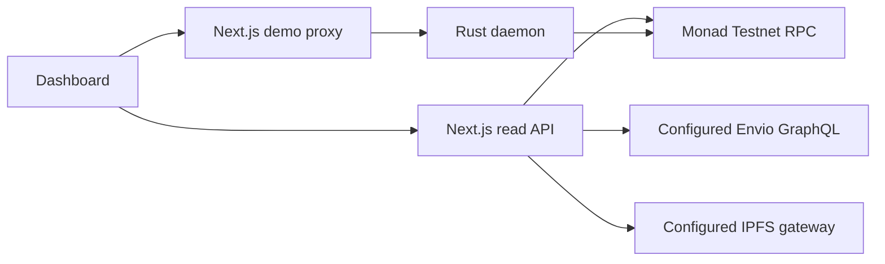

# Dashboard data, configuration and API

The frontend reads actual contract/indexer data through Next.js routes. The browser's illustrated comparison, preview and fallback cards are separate from those records. See the [judge guide](README.md) for the visual tour and the [demo guide](demo-guide.md) for paid tasks.

## Configuration

Copy [`.env.example`](../.env.example) to ignored `.env.local`. Public variables are compiled into browser code; rebuild when changing them. The frontend never needs a deployer or relayer private key.

| Browser-visible variable | Default | Purpose |
| --- | --- | --- |
| `NEXT_PUBLIC_ROUTER_ADDRESS` | Empty | Aetheris router from the verified deployment. |
| `NEXT_PUBLIC_AGENT_REGISTRY_ADDRESS` | Empty | Identity registry linked to that router. |
| `NEXT_PUBLIC_REPUTATION_REGISTRY_ADDRESS` | Empty | Matching reputation registry for directory feedback. |
| `NEXT_PUBLIC_DYNAMIC_ENVIRONMENT_ID` | Aetheris sandbox ID | Public Dynamic project identifier; defaults to `5ee665e4-6f64-43c1-9537-99d989371a80`. Override it for another environment and allow the deployment origin in Dynamic. |
| `NEXT_PUBLIC_MERA_ENABLED` | `false` | `true` enables the separate Mera module after rebuilding. |
| `NEXT_PUBLIC_MERA_RP_ID` | Current hostname when empty | Stable relying-party ID for Mera; a valid parent domain may be selected. |
| `NEXT_PUBLIC_MONAD_RPC_URL` | `https://testnet-rpc.monad.xyz` | Public wallet simulation and receipt reads on chain `10143`. No private provider key belongs here. |

| Server-only variable | Default | Purpose |
| --- | --- | --- |
| `MONAD_RPC_URL` | Public Monad Testnet RPC | RPC for server reads; may contain a private provider credential. |
| `DEPLOYMENT_BLOCK` | `0` | Earliest block of your deployment; set it from verified receipts. |
| `EVENT_LOOKBACK_BLOCKS` | `200` | Event observation window, clamped to 12–1,000 blocks. |
| `IPFS_GATEWAY` | `https://ipfs.io/ipfs/` | HTTPS gateway for `ipfs://` Agent Cards. The default may fall back once to fixed `https://gateway.pinata.cloud/ipfs/` after a transient failure; a custom gateway stays exclusive. |
| `ENVIO_GRAPHQL_URL` | Empty | Hosted Envio/Hasura `/v1/graphql` endpoint. Empty explicitly selects RPC fallback. |
| `ENVIO_GRAPHQL_ADMIN_SECRET` | Empty | Optional server-side `x-hasura-admin-secret` credential. |
| `ENVIO_GRAPHQL_TOKEN` | Empty | Optional server-side bearer token. |
| `DEMO_ENABLED` | `false` | Set `true` only after live task/payment setup. |
| `DAEMON_URL` | `http://127.0.0.1:8080` | Configured task-service origin; HTTPS is required outside localhost. |
| `DEMO_AGENT_ID` | Empty | Registered identity used by the paid browser demo. |
| `DEMO_TASK_RESOURCE` | Empty | Exact task resource URL advertised by the daemon's x402 configuration. |
| `DEMO_PAYMENT_ASSET` | Empty | Expected EIP-3009 payment-token address. |
| `DEMO_PAYMENT_RECEIVER` | Empty | Expected settlement recipient. |
| `DEMO_PAYMENT_MAX_AMOUNT` | Empty | Maximum amount per task in token base units; five tasks are submitted. |
| `DEMO_PAYMENT_ASSET_NAME` | Empty | Expected token EIP-712 domain name. |
| `DEMO_PAYMENT_ASSET_VERSION` | Empty | Expected token EIP-712 domain version. |

Server-only configuration does not mean every value is confidential: the compatible demo policy is intentionally returned to the browser for informed signing. RPC provider credentials and GraphQL access credentials stay on the server. Never prefix them with `NEXT_PUBLIC_`.

## Data flow and source selection



With Envio configured, overview activity and directory identities come from the indexer. RPC still verifies deployment linkage and supplies network throughput and reputation reads. Queries and returned entities are scoped/validated against chain, router and/or identity registry as appropriate. The directory enriches indexed identities with bounded IPFS metadata and reputation fetches.

The indexer must run this repository's current schema, including `SyncStatus`, and permit the `Agent` and `TaskExecution` aggregate queries used by the dashboard. `SyncStatus` records the previous fully processed block; source panels show that progress and lag relative to RPC. This is synchronization progress, not consensus finality.

Without `ENVIO_GRAPHQL_URL`, the API explicitly uses **RPC fallback**. A configured endpoint that is inaccessible, unauthorized or incompatible produces a visible `503`; it does not silently replace indexed results with RPC data. The frontend does not provision a hosted indexer. Follow the [indexer setup](../../indexer/README.md).

## Metric definitions and limits

| Metric or record | Scope and interpretation |
| --- | --- |
| **Active agents** | Distinct agent IDs with completed task events in the displayed observation window. Envio uses an aggregate; RPC fallback counts distinct `TaskExecuted` agent IDs. This is not registration supply. |
| **Registered identities** | Envio counts indexed identities for the configured registry; RPC fallback reads `AgentRegistry.totalSupply()`. |
| **Executions** | Task-execution count for the displayed window. Envio uses an aggregate rather than the truncated shard list. |
| **Parallel shards created** | Number of returned shards created in the window. Envio returns at most 200 recent shards and sets a capped-results indicator; a `+` does not claim a lifetime total. The visualizer displays up to 60 tiles, while its ledger retains the returned records. |
| **Total micropayments settled** | Payments independently verified for the current browser demo. It is not a chain-wide or cumulative account total. Preview activity does not increment it. |
| **Observed Monad TPS** | Transactions in the newer 11 of 12 consecutive sampled blocks divided by the oldest-to-newest timestamp difference. Fewer blocks can be sampled near chain genesis. This is observed short-window traffic, not maximum throughput. |
| **Quality score** | Uncurated mean of `quality`-tagged feedback from `getClients` and `getSummary(agentId, clients, 'quality', '')`. It is not a percentage, a Sybil-resistant score or guaranteed trustworthiness. |
| **Merkle batches** | Up to 12 recent indexed batches, with separate indexed commitments checked for the expected canonical batch ID, root, leaf count and block range. |

In Envio mode, the activity window ends at the indexed block; in RPC fallback, it ends at the observed network head. Both honor the configured deployment start. Indexed registration totals are not limited to the task-activity window. Shard and execution counts can differ because a shard may be created in one window and executed in another.

In RPC fallback, `ShardCreated` and `TaskExecuted` are joined within the same event window. A displayed “created” shard may therefore have completed outside it. The directory uses 12-item pages: indexed identities with Envio, or sequential token IDs for the supplied non-burning registry in RPC fallback. Reorganizations can change observed records.

**Root matched** is an indexer consistency check: the calculated batch agrees with a separate `BatchCommitment` marked verified. It is not proof that the work was correct, nor an independent trustless verification of the indexer. RPC fallback returns no independently indexed batch verification.

Cards preserve real zeroes. A failed refresh can retain a prior reading under **Last observed**; a missing source uses explicit **Sample data**. Samples never flow into agent entities, task tables, receipt links or GraphQL. Standard RPC does not expose scheduler concurrency, optimistic retries or a counterfactual collision count; the visual comparison is not a benchmark.

## Read API

All paths are relative to the frontend origin. Large blockchain integers and hashes remain strings in responses.

| Method and path | Successful response | Error behavior |
| --- | --- | --- |
| `GET /api/overview` | `200`: snapshot with `chainId`, head/window blocks, throughput samples, counts, shards, source, batches and per-source `errors`. Partial RPC failures may appear in a successful snapshot. | `503` for an unavailable network or unusable configured indexer. |
| `GET /api/agents?page=0` | `200`: `agents`, total count, zero-based `page`, `pageSize`, source and per-record errors. Missing/empty `page` defaults to `0`. | `400` for other page values that are not 1–6 decimal digits; `503` for missing identity configuration or unavailable registry/indexer. |

For example, inspect configuration/read responses without signing anything:

```sh
curl http://localhost:3000/api/overview
curl "http://localhost:3000/api/agents?page=0"
curl http://localhost:3000/api/demo/config
```

React Query polls the overview every 12 seconds and uses an 8-second stale interval; abandoned HTTP requests are canceled. The server coalesces snapshot requests and caches successful snapshots for 8 seconds. Agent-page requests use bounded batches and process-local caching. Caches are not shared across replicas; put appropriate request limits at the hosting/load-balancer boundary.

## Live demo API

| Method and path | Behavior |
| --- | --- |
| `GET /api/demo/config` | `200` returns validated chain/router/identity/agent configuration, relayers and the pinned x402 payment policy. `503` returns `enabled: false` and a setup/unavailability explanation. |
| `POST /api/demo/tasks` | Requires same-origin JSON and a `PAYMENT-SIGNATURE` header. Validates the configured agent/executor, task deadline, token/domain/amount and matching task/payment signers, then forwards once to daemon `POST /v1/tasks`. Returns validated job state for recognized `200`, `202` or `502` job responses. Other upstream errors remain errors. Validation/transport exceptions currently return a generic `502`, so query saved status after an ambiguous submission. |
| `GET /api/demo/tasks/[requestId]` | Status-only recovery. Malformed IDs return `400`; unknown requests return `404`; valid upstream jobs retain their status; transport/invalid-response errors return `503`. It never resubmits a payment. |

The task body contains decimal strings `agentId` and `sequenceNonce`; bytes32 `taskId`, `inputHash`, `outputHash`, `proofHash`; address `executor`; numeric `deadline`; and the task's `authorization` signature. Its exact EIP-712 domain is `AetherisTask`, version `1`, chain `10143`, verifying contract equal to the configured router. The request ID is the typed-data digest. The payment header carries base64 x402 v2 `exact` EIP-3009 authorization.

Use the provided browser workflow to construct these messages; do not reuse expired or ambiguous paid requests. The [protocol source](../lib/demo-protocol.ts) contains the shared types and validators, and the [demo guide](demo-guide.md#recover-an-interrupted-run) explains the public journal, Web Locks and status-only recovery. The daemon independently enforces current delegation, signature validity, replay protection and settlement. The frontend proxy has no signing key and is not a general-purpose upstream proxy.

## Boundaries around external data

- GraphQL requires HTTPS outside localhost, rejects redirects, times out after 8 seconds and caps responses at 1 MiB. Returned counts, addresses, hashes, IDs and ranges are validated. Raw credentials/upstream diagnostics are not intentionally exposed in browser error messages.
- Agent Cards are untrusted. Only `ipfs://` cards are fetched through the configured HTTPS gateway. Path traversal and redirects are rejected; requests have a 12-second timeout and 256 KiB response limit. Text is escaped by React. Declared service endpoints are displayed, not invoked automatically.
- The demo upstream is a configured origin without credentials, query or fragment. Redirects are rejected. Upstream GETs time out after 10 seconds and POSTs after 25 seconds; response JSON is capped at 32 KiB. Submitted task bodies are capped at 8 KiB and payment headers at 16 KiB. These timeouts do not mean an upstream transaction was canceled.
- Public wallet RPC reads remain browser-visible. Configuring a private provider URL there exposes it in the bundle; use `MONAD_RPC_URL` for private server reads.

For the authoritative implementation, see [server reads](../lib/server.ts), [indexer queries](../lib/indexer.ts), [indexer validation](../lib/indexer-protocol.ts), and [demo proxy](../lib/demo-server.ts). Consult the [verification record](../../VERIFICATION.md), [submission proof](../../SUBMISSION_PROOF.md), [ERC-8004 specification](https://eips.ethereum.org/EIPS/eip-8004), and [Monad Testnet information](https://docs.monad.xyz/developer-essentials/testnet) when preparing evidence.
